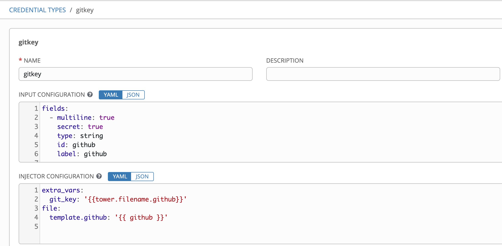
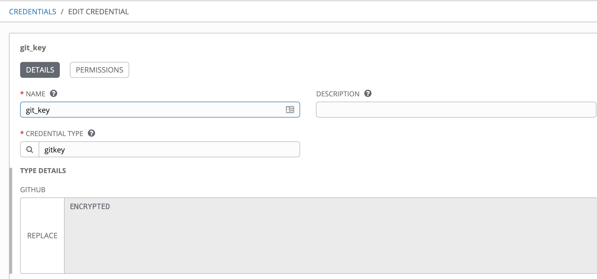

# f5backup
Create UCS Backup to Git Repo

Variables that need to be defined are as follows: 

email: global config for git email example: jmcleroy@redhat.com

git_msg: example: Adding items

git_url: example: 'git@github.com:jmcleroy/f5backups.git'

username: global config for git username example: Eric McLeroy

git_key: ssh key file passed from Ansible vault or from Ansible Tower using the below Credential Type

Then in tower create a credential that uses this type as seen below this will be a ssh key pair that you have preshared
with github in order to achieve push pull from inside of a playbook and is necessary on top of the keys needed to pull scm 
using tower instructions can be found here on how to add an ssh key if not already done so https://help.github.com/en/articles/adding-a-new-ssh-key-to-your-github-account

